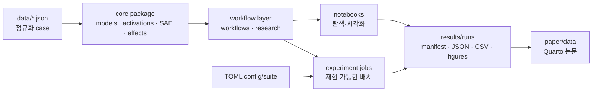

# 저장소 아키텍처

이 문서는 코드와 실행 경로의 경계를 설명하는 아키텍처 정본이다. 실험의 통계적
설계는 [study_design.md](study_design.md), 데이터 계약은 [datasets.md](datasets.md)를
따른다.

## 전체 흐름



`scripts/`는 이 흐름의 옆에서 데이터 구축·감사, 결과 통합, 외부 API 평가를 담당한다.
외부 API evaluator가 공통으로 쓰는 JSON/HTTP/JSONL 처리는
`scripts/openrouter_common.py`에 모여 있다.

## 계층별 책임

| 계층 | 파일 | 책임 |
|---|---|---|
| 데이터 모델 | `cases.py`, `lure_datasets.py`, `data/*.json` | `LureCase`와 정규화 데이터 로딩·검증 |
| 모델 경계 | `models.py` | Qwen profile, checkpoint/SAE pair, dtype/device, lazy model loading |
| activation | `activations.py` | NNsight decoder block 탐색과 residual capture |
| SAE | `qwen_scope.py` | checkpoint 로드, TopK/선택 feature encoding, decoder direction |
| 효과 측정 | `effects.py` | continuation logprob, margin, residual intervention |
| 행동 생성 | `generation.py` | Qwen 응답 생성·분류·retry·요약 |
| 탐색 workflow | `workflows.py` | notebook 수준의 feature search/sweep/transfer loop |
| 통제 연구 | `research.py` | split, null, held-out aggregation, specificity, behavioral readout |
| 배치 실행 | `experiments/jobs`, `experiments/runners` | config 해석, Colab 실행, 산출물 회수 |

## 의존 방향

의존성은 가능한 한 아래 방향만 허용한다.

```text
cases/models
    ↓
activations/qwen_scope/generation
    ↓
effects
    ↓
workflows/research
    ↓
notebooks/experiment jobs/scripts
```

핵심 규칙:

- `src/`는 notebook, `experiments/`, `scripts/`를 import하지 않는다.
- 네트워크와 대형 모델 로드는 함수 호출 시점에만 일어난다.
- 패키지 최상위 `mindscopex_analysis`는 flat public API를 lazy-resolve한다. 가벼운
  데이터 import가 Torch/Hugging Face 전체를 eager-load하지 않는다.
- notebook과 batch job은 채점·개입 공식을 다시 구현하지 않고 코어 함수를 호출한다.
- 결과에는 config, seed, 환경, git 상태를 포함한 manifest를 남긴다.

## 코어 데이터 계약

모든 실험 case는 `LureCase`로 수렴한다.

```text
case_id · family · prompt · correct_answer · lure_answer
control_prompt · note · pair_id · template_id · condition
```

`logprob_margin` 데이터는 correct/lure answer가 모두 필요하다.
`binary_choice` 데이터도 두 후보를 요구하지만, 후보 순서를 counterbalance한 행동
선택으로 채점한다.
`premise_rejection` 데이터는 자유형 judge를 사용하므로 answer가 비어 있을 수 있다.
JSON 원본의 question은 loader에서 한 번만 `\nAnswer:` 형식으로 변환된다.

## 계산 경로

Feature 인과 효과는 다음 순서로 측정한다.

1. prompt의 지정 layer residual을 캡처한다.
2. SAE TopK로 후보를 찾고, 필요한 feature activation만 선택 계산한다.
3. correct/lure continuation의 baseline logprob margin을 계산한다.
4. 같은 decoder direction을 residual에 개입해 edited margin을 계산한다.
5. `margin_delta = baseline_margin - edited_margin`을 기록한다.

Layer search와 intervention-mode sweep은 candidate와 무관한 residual/baseline을 한 번
계산해 재사용한다. 선택 feature activation은 전체 SAE 사전을 매번 계산하지 않는다.

## 실행과 산출물

- notebook: 설명과 디버깅에 적합하지만 실행 상태가 숨을 수 있다.
- experiment config/job: 논문용 재현 실행의 정본이다.
- `results/runs/`: launcher manifest, 원격 log, raw/summary artifact를 보관한다.
- `paper/data/`: 검토를 마친 figure/table 입력만 복사한다.

새 코어 로직은 `src/`에 두고 단위 테스트를 추가한다. 특정 연구 실행에만 필요한
orchestration은 `experiments/jobs/`, 일회성 구축·감사는 `scripts/`에 둔다.
