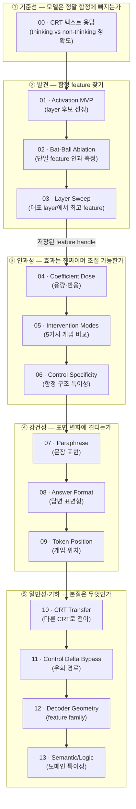
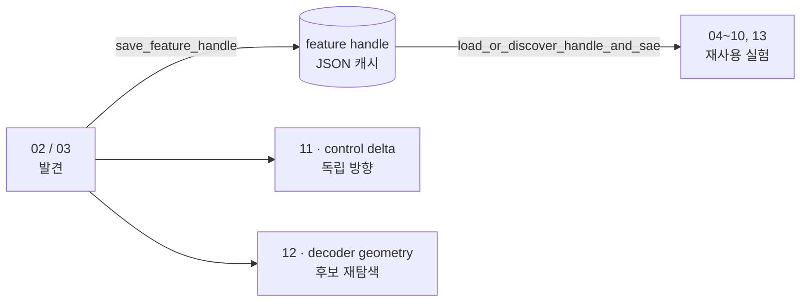
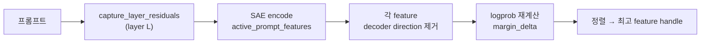

# 노트북 파이프라인 가이드 (00 → 13)

이 문서는 `notebooks/` 안의 노트북 14개가 **무엇을, 어떤 순서로** 수행하는지 정리합니다.
전체 흐름은 하나의 연속된 실험입니다:

> **CRT 함정 행동 관찰 → 내부 activation 캡처 → 함정 유발 feature 발견 → 인과성 검증 → 강건성·일반성·기하 분석**

모든 개입은 SAE feature의 **decoder direction**을 residual stream에서 빼거나 더해
정답과 함정 답의 **logprob margin**이 얼마나 바뀌는지로 측정합니다.
지표 해석은 [metrics_guide.md](metrics_guide.md)를 참고하세요.

---

## 1. 전체 지도 (한눈에 보기)

| 단계 | 노트북 | 한 줄 질문 |
|------|--------|-----------|
| ① 기준선 | `00` | 모델이 실제로 함정 답을 내는가? thinking이 고쳐주는가? |
| ② 발견 | `01` `02` `03` | 함정 답을 밀어 올리는 feature는 어느 layer의 무엇인가? |
| ③ 인과성 | `04` `05` `06` | 그 feature를 건드리면 답이 조절되는가? 함정 구조에 특이적인가? |
| ④ 강건성 | `07` `08` `09` | 문장·답변형식·토큰 위치를 바꿔도 효과가 유지되는가? |
| ⑤ 일반성 | `10` `11` `12` `13` | 다른 문제로 전이되는가? 우회 가능한가? 한 family인가? 산술 전용인가? |

> **핵심 산출물 — feature handle:** `03`(또는 `02`)이 찾은 최고 feature를
> `outputs/candidates/bat_ball_top_feature_answer_instruction_{profile}.json`에 저장합니다.
> `04`~`10`, `13`은 이 handle을 캐시에서 **로드해서 재사용**합니다. 캐시가 없으면
> 프로필의 두 번째 scan layer에서 후보를 다시 찾습니다. `11`은 control residual delta를
> 직접 만들고, `12`는 decoder geometry용 후보를 다시 순위화하므로 handle에 의존하지 않습니다.

---

## 2. 공통 재료

| 재료 | 값 |
|------|-----|
| 해석용 모델 | 프로필별 Qwen3.5 분석 checkpoint; 기본값은 exact `Qwen3.5-27B` |
| 행동 관찰 모델 (`00`) | post-trained `Qwen3.5-2B / 9B / 27B / 35B-A3B` |
| SAE | 프로필별 공식 Qwen-Scope K50 SAE; 27B만 post-trained checkpoint와 직접 일치 |
| 대표 케이스 | `BAT_BALL_CASE` — 정답 `" 5 cents"`, 함정 `" 10 cents"` |
| 주 스캔 layer | 프로필의 전체 깊이를 4구간으로 나눈 `PROFILE.scan_layers` |
| 개입 단위 | `coefficient × feature_value × W_dec[:, feature_id]` |
| 측정 지표 | `margin = logprob(lure) − logprob(correct)`, `margin_delta = baseline − edited` |

프로필별 대표 scan layer는 다음과 같습니다. 네 점은 전체 layer sweep이 아니라 초기 탐색
비용을 줄이기 위한 깊이별 표본입니다. 논문 주 결과에서는 후보 구간 주변 layer를 추가로
촘촘히 탐색해야 합니다.

| 프로필 | 분석 checkpoint | 대표 scan layer | SAE와 checkpoint 관계 |
|---|---|---|---|
| `2b` | `Qwen3.5-2B-Base` | `5, 11, 17, 23` | exact Base |
| `9b` | `Qwen3.5-9B-Base` | `7, 15, 23, 31` | exact Base |
| `27b` | `Qwen3.5-27B` | `15, 31, 47, 63` | exact post-trained |
| `35b-a3b` | `Qwen3.5-35B-A3B-Base` | `9, 19, 29, 39` | exact Base, MoE |

대부분의 실험 로직은 `src/mindscopex_analysis/workflows.py`의 `*_rows()` 헬퍼로 모듈화되어 있어,
노트북은 "로드 → 헬퍼 호출 → 표/그래프"의 얇은 흐름만 유지합니다.

---

## 3. 단계별 상세

### ① 기준선

#### `00_qwen_crt_text_responses` — CRT 실제 텍스트 응답
- **목적:** Qwen 모델군에 pilot 또는 Nature CRT-150을 직접 풀게 해, thinking / non-thinking
  모드별로 **함정에 빠지는지** 실측 기준점을 만든다.
- **입력:** `RUN_PRESET=pilot/nature_smoke/nature_full`, Qwen3.5 네 모델, thinking/non-thinking,
  하나 이상의 seed. `GENERATION_PROTOCOL`로 Qwen-native sampling과 deterministic 기준선을 분리한다.
- **단계:** 모델 로드 → 모드별 응답 생성 → thinking 블록/프로토콜/형식 준수 점검 → 정답·함정 라벨 분류 → 정확도 집계.
- **함수:** `load_qwen_text_generation_model`, `generate_crt_response_suite`, `summarize_crt_accuracy`, `save_qwen_text_responses`.
- **산출물:** `outputs/00_qwen_crt_text_responses_{preset}_{protocol}_seeds-{seeds}.json`과
  `.md`, 모델·모드 전체 및 CRT family별 정답률·함정률·Wilson 95% 구간과 그래프.
- **다음으로:** 함정에 안정적으로 빠지는 케이스(특히 bat-ball)를 내부 분석 대상으로 선정 → `01`.

### ② 발견

#### `01_qwen_scope_activation_mvp` — Activation 캡처 MVP
- **목적:** NNsight로 residual activation을 뽑고 SAE로 해석해, feature가 가장 강하게 켜지는 **layer 후보**를 고른다.
- **입력:** 5개 프롬프트(bat-ball 등), 프로필별 `scan_layers`, token 위치 `"last"`.
- **단계:** 모델 로드 → `capture_layer_residuals` → SAE 로드 → `summarize_qwen_scope_features`로 상위 feature → `scan_qwen_scope_layers`로 layer별 품질 점수 → 최고 layer 선택.
- **함수:** `capture_layer_residuals`, `load_qwen_scope_sae`, `summarize_qwen_scope_features`, `scan_qwen_scope_layers`, `top_qwen_scope_features`.
- **산출물:** layer별 상위 feature 표(rank, feature_id, mean_abs, activation_rate)와 후보 layer.

#### `02_bat_ball_lure_feature_ablation` — Bat-Ball 단일 feature ablation
- **목적:** bat-ball에서 **함정 답 logprob을 끌어올리는 feature**를 ablation으로 식별하고 효과를 정량화한다.
- **입력:** `instruct_lure_case(BAT_BALL_CASE)`, 프로필의 두 번째 scan layer, 상위 후보 12개, 계수 1.0.
- **단계:** baseline margin 측정 → 선택 layer residual 캡처 → SAE encode 상위 12 feature → 각 feature의 decoder direction 제거 후 logprob 재계산 → `margin_delta`로 정렬 → 최고 feature handle 저장.
- **함수:** `answer_logprob_margin`, `active_prompt_features`, `rank_lure_feature_effects`, `feature_handle_from_result`, `save_feature_handle`.
- **산출물:** feature별 `margin_delta / lure_logprob_delta / correct_logprob_delta` 표, 프로필명이 붙은 feature-handle JSON.

#### `03_layer_sweep_feature_search` — Representative layer sweep
- **목적:** `02`의 ablation을 프로필의 **대표 scan layer 네 곳으로 확장**해 함정 답에 가장 큰 영향을 주는 layer-feature 조합을 찾는다.
- **입력:** 프로필별 `scan_layers`, layer당 상위 8개 후보, 계수 1.0.
- **단계:** 각 layer SAE 로드 → `layer_feature_search_rows`(layer별 feature 추출 + ablation + margin 재계산) → `margin_delta` 정렬 → 최고 handle 저장.
- **함수:** `layer_feature_search_rows`, `load_qwen_scope_sae`, `feature_handle_from_result`, `save_feature_handle`.
- **산출물:** layer×feature 행 표와, 이후 단계가 공유하는 최종 feature handle.

### ③ 인과성

#### `04_coefficient_dose_response` — 용량-반응
- **목적:** 제거 강도(계수)를 바꿀 때 margin이 **연속·단조**로 변하는지(= 일회성 우연이 아닌 인과) 확인.
- **입력:** 저장된 handle, 계수 `[-2, -1, -0.5, 0, 0.25, 0.5, 1, 1.5, 2]`.
- **단계:** handle/SAE 로드 → `coefficient_sweep_for_handle` → 계수별 margin·delta·logprob 변화 → 3개 그래프(선호도 / 개입 효과 / 효과의 출처).
- **함수:** `load_or_discover_handle_and_sae`, `coefficient_sweep_for_handle`.
- **읽기:** 양수 구간에서 `margin_delta` 단조 증가 → 강한 인과 근거. 음수에서 반대 효과 → 양방향 steering 가능성.

#### `05_intervention_mode_comparison` — 개입 방식 비교
- **목적:** 같은 feature에 **5가지 개입**을 적용해 메커니즘 차이를 비교.
- **입력:** handle, 계수 1.0, 모드 `remove_activation / projection_remove / subtract_unit / add_activation / add_unit`.
- **단계:** `intervention_mode_rows`로 모드별 margin 변화 측정 → 표 비교.
- **읽기:** remove·projection 모두 margin 감소 → decoder direction 자체가 중요. add 계열에서 반대 효과 → steering 신호.

#### `06_control_prompt_specificity` — 함정 구조 특이성
- **목적:** feature가 **함정 논리에 특이적**인지, 아니면 bat/ball 어휘·수식 형식 같은 일반 feature인지 판별.
- **입력:** 원 케이스 + matched control(`control_prompt`, "bat costs $1.05" — 함정 없는 뺄셈).
- **단계:** `case_transfer_rows`로 두 케이스에 동일 feature 적용 비교 → control에서 `candidate_feature_rows`로 별도 상위 feature 확인.
- **읽기:** lure에서 큰 효과 + control에서 작은 효과 → 진짜 lure-specific. 둘 다 크면 형식·어휘 일반 feature 의심.

### ④ 강건성

#### `07_paraphrase_robustness` — 문장 표현 강건성
- **목적:** 정답/함정은 그대로 두고 문장만 바꾼 paraphrase에서도 효과가 유지되는지(표면 문자열 의존 여부).
- **입력:** `bat_ball_paraphrases()`(slow, short, Korean, book-toy 등).
- **함수:** `instruct_lure_cases`, `case_transfer_rows`.
- **읽기:** original에서만 효과 → overfit 후보. short/Korean/book-toy까지 유지 → 추상적 algebraic-lure feature.

#### `08_answer_format_sensitivity` — 답변 표면형 민감도
- **목적:** 효과가 특정 답변 문자열에 묶였는지, 숫자 **의미**에 작동하는지 검증.
- **입력:** `bat_ball_answer_variants()`(words / bare number / `$0.05` / 문장).
- **함수:** `sae_decoder_direction`, `answer_variant_rows`.
- **읽기:** 모든 표면형에서 유사 효과 → reasoning/lure feature. 특정 문자열만 강함 → tokenization·템플릿 효과.

#### `09_token_position_sweep` — 개입 위치 민감도
- **목적:** feature가 어느 **prompt 토큰 위치**에서 작동해야 효과가 나는지.
- **입력:** prompt 끝 주변 token window(`window≈8~10`).
- **함수:** `prompt_token_window_rows`, `token_position_sweep_rows`.
- **읽기:** 마지막 토큰(`Answer:`)에서만 효과 → answer-selection feature. 본문 토큰에서도 효과 → 문제 해석 과정에 관여.

### ⑤ 일반성·기하

#### `10_crt_transfer` — 다른 CRT로 전이
- **목적:** bat-ball feature가 구조가 다른 CRT(machines/widgets, lily pads, printers)로 **전이**되는지.
- **입력:** `crt_transfer_cases()`, 동일 handle, `remove_activation`.
- **함수:** `crt_transfer_cases`, `case_transfer_rows`.
- **읽기:** 산술 CRT만 전이 → 산술 lure feature. 성장·비율까지 전이 → 더 일반적인 intuitive-answer feature.

#### `11_control_delta_bypass` — 우회 경로
- **목적:** feature를 직접 제거하지 않고, **matched control residual과의 차이 벡터**를 더해 함정을 우회할 수 있는지.
- **입력:** 프로필의 두 번째 scan layer, `direction = control_residual − lure_residual`, 계수 `[-1 … 2]`, `add_vector` 모드.
- **함수:** `control_delta_bypass_rows`.
- **읽기:** 양수 계수에서 margin 감소 → matched 표현이 함정 경로를 우회. 음수와 비교해 방향성 확인.

#### `12_decoder_geometry` — feature family
- **목적:** 상위 후보들이 **비슷한 decoder direction**을 갖는지(한 family인가, 서로 다른 경로인가).
- **입력:** 프로필의 두 번째 scan layer 상위 12 후보 → 효과 상위 8개.
- **함수:** `candidate_feature_rows`, `rank_lure_feature_effects`, `decoder_cosine_rows`.
- **읽기:** 강한 후보끼리 cosine 높음 → 한 feature family. cosine 낮은데 효과 비슷 → 독립 경로.

#### `13_semantic_logic_specificity` — 도메인 특이성
- **목적:** bat-ball feature가 **semantic illusion / logic lure**에도 작동하는지(산술 전용인지).
- **입력:** `semantic_lure_cases()`(Moses ark, widow's sister, affirming the consequent).
- **함수:** `semantic_lure_cases`, `instruct_lure_cases`, `case_transfer_rows`.
- **읽기:** semantic/logic 효과 작음 + CRT 효과 큼 → 산술 도메인 특이 feature. 전반적으로 크면 일반 caution/lure-suppression 계열.

---

## 4. 노트북 ↔ 핵심 함수 매핑

| 노트북 | 주요 `workflows`/모듈 함수 | 핵심 산출 |
|--------|---------------------------|-----------|
| `00` | `generate_crt_response_suite`, `summarize_crt_accuracy` | CRT 정확도 기준선 |
| `01` | `capture_layer_residuals`, `scan_qwen_scope_layers` | layer 후보 |
| `02` | `rank_lure_feature_effects`, `save_feature_handle` | feature handle |
| `03` | `layer_feature_search_rows` | layer-sweep 최고 feature |
| `04` | `coefficient_sweep_for_handle` | 용량-반응 곡선 |
| `05` | `intervention_mode_rows` | 개입 방식 비교 |
| `06` | `case_transfer_rows`, `candidate_feature_rows` | 함정 특이성 |
| `07` | `case_transfer_rows` (paraphrase) | 문장 강건성 |
| `08` | `answer_variant_rows` | 답변형식 강건성 |
| `09` | `prompt_token_window_rows`, `token_position_sweep_rows` | 위치 민감도 |
| `10` | `case_transfer_rows` (CRT) | 전이성 |
| `11` | `control_delta_bypass_rows` | 우회 가능성 |
| `12` | `decoder_cosine_rows` | feature family 기하 |
| `13` | `case_transfer_rows` (semantic/logic) | 도메인 특이성 |

---

## 5. 관련 문서

| 문서 | 내용 |
|------|------|
| [metrics_guide.md](metrics_guide.md) | `margin`, `margin_delta`, ablation 등 지표 해석 |
| [colab_cli_workflow.md](colab_cli_workflow.md) | Colab GPU 실행 결과를 로컬로 회수하는 CLI 절차 |
| `CLAUDE.md` | 레포 개요와 핵심 경로 |
| `src/mindscopex_analysis/workflows.py` | 노트북이 호출하는 `*_rows()` 실험 헬퍼 |

---

## 6. 실행 순서와 연구 판정 기준

1. `00`에서 모델·thinking 모드별로 실제 lure 응답이 존재하는지 확인한다.
2. `01`은 activation/SAE shape와 대표 layer 탐색이 가능한지 확인하는 smoke test로 사용한다.
3. `02`에서 단일 layer 파이프라인을 검증한 뒤 `03`에서 프로필별 feature handle을 확정한다.
4. `04`의 dose response와 `05`의 역방향 steering이 재현되어야 인과 후보로 유지한다.
5. `06`~`10`, `13`에서 control, paraphrase, 답변 표면형, token 위치, 다른 CRT 및 다른 lure
   도메인으로 일반화되는지 분리해 보고한다.
6. `11`과 `12`는 feature 제거와 다른 우회 방향 및 feature-family 기하를 묻는 보조 분석이다.

단일 문항·단일 seed·단일 coefficient의 큰 `margin_delta`만으로 연구 결론을 내리지 않습니다.
discovery/held-out 분리, 여러 seed, matched control, dose response가 함께 재현될 때만 lure
feature의 인과적 역할을 주장합니다.
